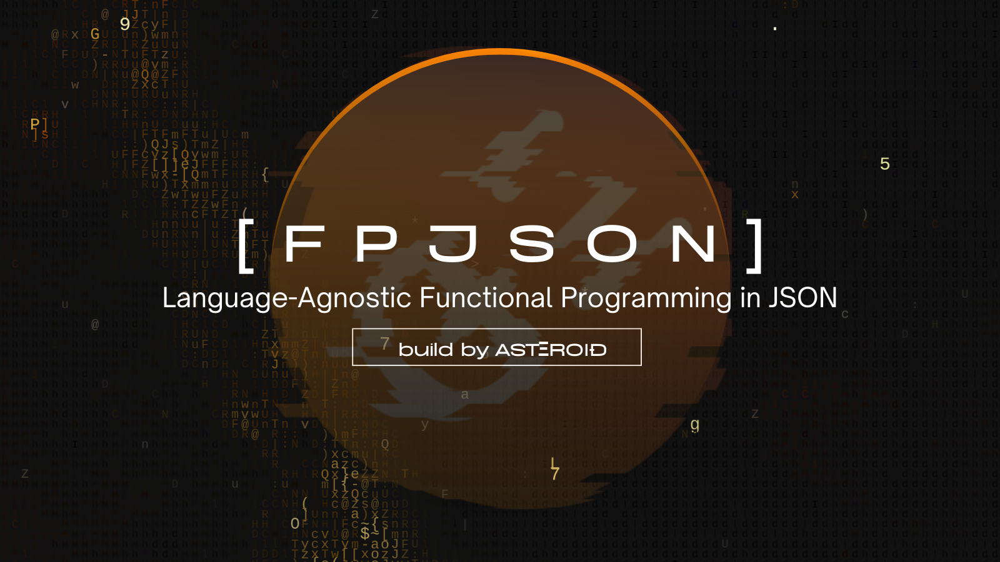

# FPJSON

[FPJSON](https://fpjson.asteroid.ac) is a programming language agnostic JSON-based functional programming language.

- The whole code is just a JSON array
- Functional Programming
- No overhead due to programming language implementation details

In other words, you don't have to worry about any programming language specifications.

Instead you can just focus on building pure logics for data manipuration.

Since it's just a JSON array, it can be ported to any programming language environment.

#### Some Examples

```javascript
/* add */
["add", 1, 2] // = 3

/* difference */
["difference", [1, 2, 3], [3, 4, 5]] = [1, 2]

/* map */
[["map", ["inc"]], [1, 2, 3]] // = [4, 5, 6]

/* compose */
[["compose", ["map", ["inc"]], ["difference"]], [1, 2, 3], [3, 4, 5]] // = [2, 3]
```
There are more than 250 pre-defined functions. And you can further extend that library.

## Install

For now the parser is only implemented in JavaScript and it borrows heavily from [Ramda.js](https://ramdajs.com/).

In fast, you can use most of the functions in Ramda with FPJSON.

```bash
yarn add fpjson-lang
```

## Usage

It couldn't be simpler.

```javascript
import fpjson from "fpjson-lang"

const one_plus_two = fpjson(["add", 1, 2]) // = 3
```

## Syntax

You should familiarize yourself with Ramda which enables Haskell-like functional programming with JS. You can use most of the powerful ramda functions with point-free style in JSON.

The first element in an array is a function.

```javascript
["add", 1, 2] // add(1, 2)
```

To curry a function, nest it.

```javascript
[["add", 1], 2] // add(1)(2)
```

A function always needs to be wrapped with `[]` and to be the first element in the array.

```javascript
[["map", ["inc"]], [1, 2, 3]] // map(inc)([1, 2, 3])
```

This is an error because `inc` is imterpreted as `String`.
```javascript
[["map", "inc"], [1, 2, 3]] // map("inc")([1, 2, 3])
```

Point-free style means you cannot write something like this with the JSON format.

```javascript
sortBy((v)=> v.age)(people) // ramdajs
```

It's because you cannot write arbitrary JS lines such as `(v)=> v.age`.

Instead, you can achieve the same using another ramda funciton `prop`.

```javascript
sortBy(prop("age"), people) // ramdajs
["sortBy",["prop", "age"], people] // FPJSON
```

## Reserved First Words

By placing a reserved word in the first spot of an array, you can access the pre-built features.

There are just 6 of them.

#### "[]"

To create an array of functions without executing them, place `"[]"` in the first spot, otherwise the `["lte", 2]` function will be executed with `["gt", 2]` before `-3` is passed.

```javascript
[["anyPass", ["[]", ["lte", 2], ["gt", 2]]], -3] // anyPass(lte(2), gt(2))(-3)
```

#### "typ"

To create a type object such as `Number`, `Boolean`, `String`, `Array`, and `Object`.
```javascript
["is", ["typ", "String"], "abc"] // is(String, "abc")
```

#### "reg"

To create a `RegExp`.
```javascript
["test", ["reg", "a", "i"], "ABC"] // test(new RegExp("a", "i"), "ABC")
```

#### "let"

Pure functional programming without any side-effects is easy to get extremely complex and entangled even for simple logics.

`"let"` inserts global variables to ease up the unnecessary complexisities.

```javascript
["let", "num1", 1] // let var1 = 1
```

#### "$"

To access previously defined variables, use `"$"`.

```javascript
["add", ["var", "num1"], 1] // add(num1, 1)
```

In practice, you need to use `"let"` and `"$"` in the same array.

```javascript
[["pipe", ["add", 1], ["let", "num1"], ["$", "num1"]], 1]) // = 2
```

Or you can pass a store object as the second argument to `fpjson`.

```javascript
let vars = {}
fpjson(["let", "num1", 1], vars) // vars = { "num1" : 1 }
fpjson(["add", ["$", "num1"], 1], vars) // 2
```

#### "var"

`var` works just like `$` except that `var` needs another argument to invoke.

The last argument can be anything since it will be ignored.

Note that you cannot access a new value within the same composition where it was defined. 

```javascript
let vars = {}
fpjson(["let", "num1", 1], vars) // vars = { "num1" : 1 }
fpjson(["add", ["var", "num1", true], 1], vars) // 2
```

#### Dynamic Variables

Variable names can be dinamically specified with `$dynamic_path`.

```javascript
let vars = {}
fpjson(["let", "num1", 1], vars) // vars = { "num1" : 1 }
fpjson(["let", "ln", "num1"], vars) // vars = { "num1" : 1, "ln" : "num1" }
fpjson(["add", ["$, "$ln"], 1], vars) // 2
```

#### Dot Notation

Nested fields can be accessed with `.`.

```javascript
let vars = {}
fpjson(["let", "o", { num: 1 }], vars) // vars = { "o" : { "num": 1 } }
fpjson(["var", "o.num", true ], vars) // 1
```

## Who is Using FPJSON?

FPJSON is used to define access control rules and cron jobs in [WeaveDB](https://weavedb.asteroid.ac/) - Arweave-based decentralized NoSQL Database. FPJSON allows super rich and complex programming logics to be stored as JSON data on smart contracts, which opens up a whole new pradigm to dapp development.

FPJSON is also to be used for natural language generation algorithms, which will lead to the next-gen AI paradigm to revolutionize the human languages.

## POLP (Proof Of Learning Protocol)

POLP is planned to be launched soon. Anyone who completes the exam with 100% score can mint an SBT/NFT to proove the success, and we will form a closed community with hyper productive engineers and the like-minded where you will have an access with the NFT.

The interactive tutorials and the exam are MVPs of such a future-proof learning system.

## Tutorials

Learning functional programming is pretty challenging. So we created interactive tutorials and an exam to make sure you can familiarize yourself with all the core functions with ease!

Going through the tutorials will install a new framework in your brain and make you a better programmer in general even if you never need FPJSON.

It's not so much about languages, but about how your brain agnostically operates on data structures.
